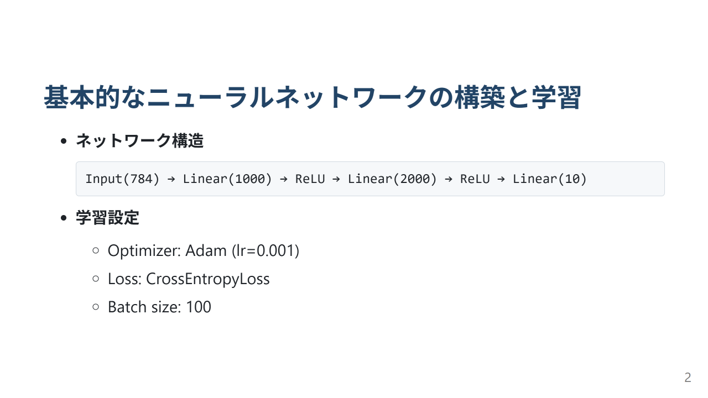
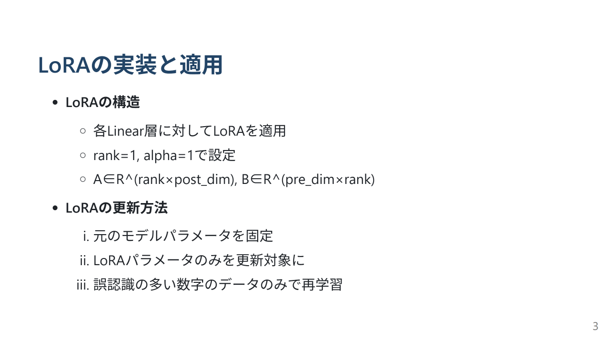
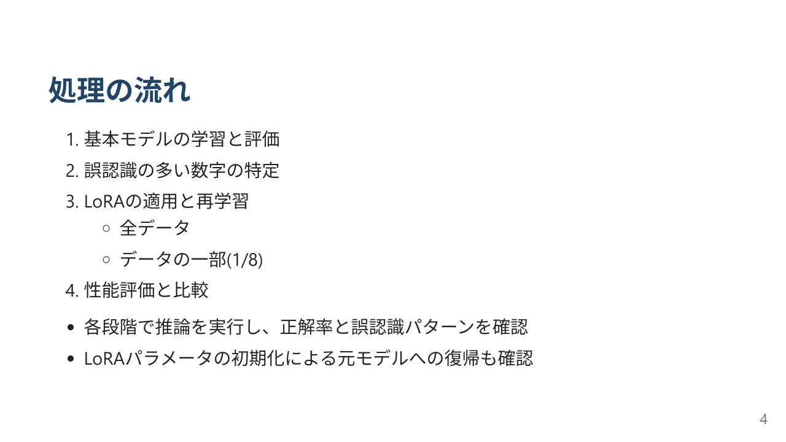

# このフォルダのプログラムについて

このフォルダのmainプログラム(main.ipynb)は、LoRAの勉強や理解を兼ねて、シンプルな画像分類タスクのニューラルネットワークモデルに対してLoRAを実装して、LoRAの有無の違いを調べてみたものになります。

## 概要

## 詳細

main.ipynbではMNISTのデータを題材にして下記を行っています。 

- クラスMyNetで実装したパラメータ数約280万のニューラルネットワークモデルで画像分類を実施
- 画像分類で一番間違いの多かったクラスをピックアップ
- クラスMyLoRAでLoRAを定義
- torch.nn.utils.parametrize.register_parametrizationで定義したLoRAをニューラルネットワークモデルに付与 &nbsp;⇒LoRAのパラメータ数は約6800
- 画像分類で一番間違いの多かったクラスの全データを用いて学習 &nbsp;⇒推論を行うと、対象のクラスは極端に正解が向上するけれど、他のクラスの正解は極端に下がり、全体的な正解率は下がる
- 学習したLoRAを初期化
- 画像分類で一番間違いの多かったクラスの一部データ(全データの8分の1)を用いて学習 &nbsp;⇒推論を行うと、対象のクラスの正解は向上しつつ、他のクラスの正解もあまり下がらずで、全体的な正解率は保てる

## 所感

題材にも寄るのかもしれないけれど、LoRAによって全体の精度そのものが向上するというよりは、狙ったクラスの精度は向上しつつも全体の精度はあまり変わらないものなのかもしれない。 
画像生成で、LoRAによって狙った画像をモデルに容易に生成出来るようにするというのは、応用として確かにと思った。
